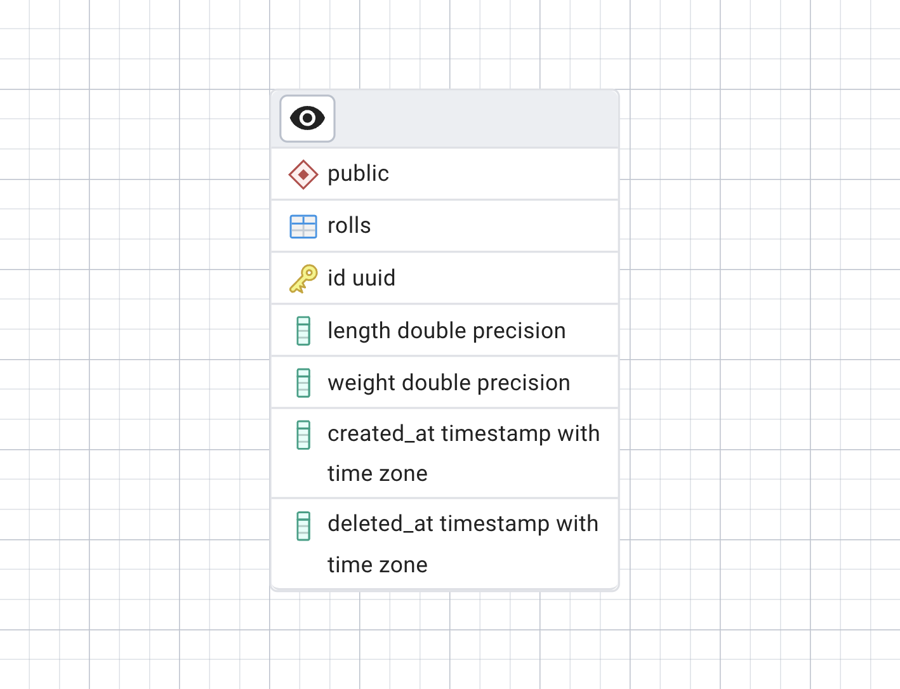

# Управление складом рулонов металла

REST API для управления запасами на складе рулонов металла и расчета статистики с течением времени.

## Локальная разработка .NET CLI (UNIX-система)

### Сборка


```bash
# В корне проекта
dotnet restore
dotnet build
```

### Запуск
```bash
# В корне проекта
dotnet run --project WarehouseRolls.Api/
```

### Тесты
```bash
# В корне проекта
dotnet test
```

или
```bash
dotnet test WarehouseRolls.Tests/
```

## Docker

### Структура
```
├── Dockerfile           # Приложение
├── Dockerfile.test      # Тесты  
├── docker-compose.yml   # App + Tests + PostgreSQL
├── .app.env             # Приложение
├── .test.env            # Тесты
├── .postgres.env        # БД app
└── .postgres-test.env   # БД тестов
```

### Команды

| Действие    | Команда                               | Результат                     |
| ----------- | ------------------------------------- | ----------------------------- |
| Приложение  | docker-compose up --build             | http://localhost:8080/swagger |
| Тесты       | docker-compose --profile test up test | Запуск тестов.                |
| Остановка   | docker-compose down                   | Остановка и удаление контейнеров                    |
| Остановка   | docker-compose --profile test down                   | Остановка и удаление контейнеров                    |

### Переменные окружения
| Файл               | Переменная                           | Значение                                                                                 | Описание         |
| ------------------ | ------------------------------------ | ---------------------------------------------------------------------------------------- | ---------------- |
| .app.env            | ConnectionStrings__DefaultConnection | Host=postgres;Port=5432;Database=WarehouseRolls;Username=warehouse;Password=warehouse123 | БД для приложения       |
| .app.env            | ASPNETCORE_ENVIRONMENT               | Production или Development(Swagger доступен)                                                                              | Среда (Разработка или продукция) |
| .test.env          | ConnectionStrings__DefaultConnection | Host=postgres-test;Port=5432;Database=WarehouseRollsTest;...                             | Тестовая БД      |
| .postgres.env       | POSTGRES_DB                          | WarehouseRolls                                                                           | Имя БД app       |
| .postgres.env       | POSTGRES_USER                         | warehouse                                                                           | Имя user'а app       |
| .postgres.env       | POSTGRES_PASSWORD                         | warehouse123                                                                           | Пароль app     |
| .postgres-test.env | POSTGRES_DB                          | WarehouseRollsTest                                                                       | Имя тестовой БД  |
| .postgres-test.env | POSTGRES_USER                          | ...                                                                       | Имя user'а  |
| .postgres-test.env | POSTGRES_PASSWORD                          | ...                                                                       | Пароль |

## ERd



